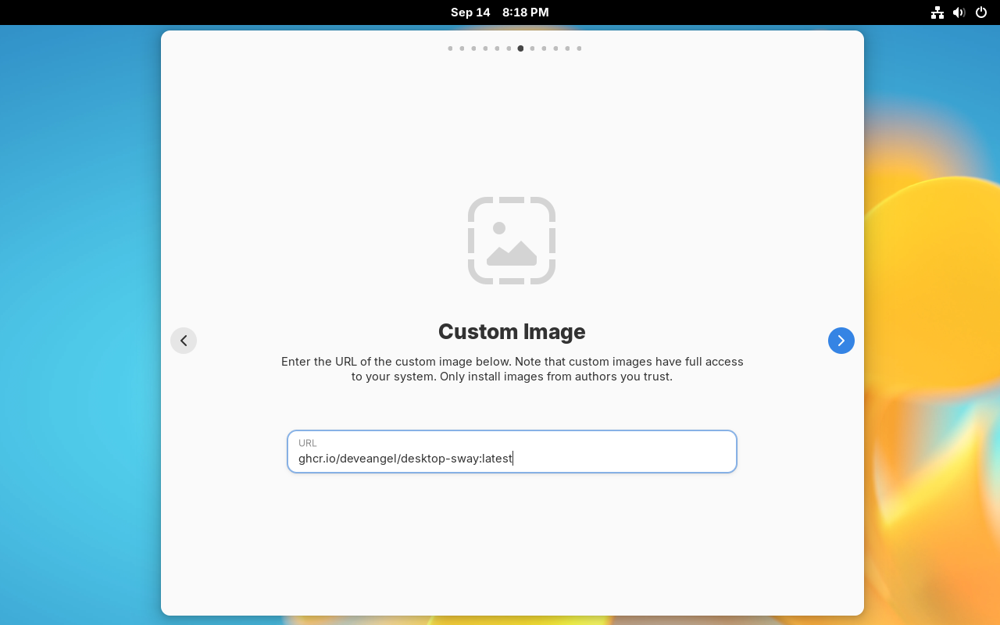

# Vanilla OS Desktop Image with Gnome and Sway-WM

Containerfile for building a Vanilla OS Desktop image with Gnome and Sway-WM. 

This image is based on top of vanillaos/desktop and extends the default Vanilla OS Gnome Desktop experience with Sway.


## Sway

[Sway](https://swaywm.org/) is a tiling Wayland compositor and a drop-in replacement for the i3 window manager for X11.

Sway allows you to arrange your application windows *logically*, rather than *spatially*.
Windows are arranged into a grid by default which maximizes the efficiency of your screen and can be quickly manipulated using only the keyboard. 

## Project Goals

We want to provide a similar experiance as the [Manjaro Sway Edition](https://github.com/manjaro-sway/manjaro-sway) does for Manjaro Linux.

## Features

 * Vanilla OS background image
 * screen locking: [swaylock](https://github.com/swaywm/swaylock), triggered by [swayidle](https://github.com/swaywm/swayidle)
 * app launcher: [Fuzzel](https://codeberg.org/dnkl/fuzzel)
 * bar: [Waybar](https://github.com/Alexays/Waybar)
 * logout menu: [wlogout](https://github.com/ArtsyMacaw/wlogout)
 * notifications: [SwayNotificationCenter](https://github.com/ErikReider/SwayNotificationCenter)
 * print screen / video capture with Print key: [sway-interactive-screenshot](https://github.com/moverest/sway-interactive-screenshot)
   - [XDG Desktop Portal](https://github.com/flatpak/xdg-desktop-portal) backend: [xdg-desktop-portal-wlr](https://github.com/emersion/xdg-desktop-portal-wlr)
   - [grim](https://sr.ht/~emersion/grim/) to take the screenshot
   - [slurp](https://github.com/emersion/slurp) to select an area on the screen
   - [swappy](https://github.com/jtheoof/swappy) to edit the captured screenshot
   - [xdg-utils](https://www.freedesktop.org/wiki/Software/xdg-utils/) to open the captured screenshot with the default image viewer
   - [dragon-drop](https://github.com/mwh/dragon) to drag and drop the captured screenshot
   - [wl-clipboard](https://github.com/bugaevc/wl-clipboard) to copy the screenshot to the clipboard
   - [wf-recorder](https://github.com/ammen99/wf-recorder) to capture videos
 * brightness control with XF86MonBrightnessUp/Down keys: [blight](https://github.com/voltaireNoir/blight) 0.7.1
 * based on Vanilla OS Desktop image (Gnome3 desktop)

## Managing user applications with systemd

 * sway's output handled by journald: `journalctl --user --identifier sway`
 * `waybar.service`
 * `swaync.service`
 * `xdg-desktop-portal.service`
 * `xdg-desktop-portal-wlr.service`
 * `sway-session.target`
 * `swayidle.service`
 * `swaylock.service`

Guide used: [systemd integration - Managing user applications with systemd](https://github.com/swaywm/sway/wiki/Systemd-integration#managing-user-applications-with-systemd)

## Installation

### Method A: Custom Image via Live-ISO

Download the Vanilla OS 2 Orchid Live-ISO, flash it to your USB stick and boot from it.

You will see the following dialog:


Select `Install Custom Image (Advanced)`.
This installation method differs in one step from the `Install` method:
You can choose the Vanilla OS Image which will be installed by the Vanilla OS Installer.

At some point, you will see the following dialog:



Enter the URL `ghcr.io/develangel/desktop-sway:latest`.


After installing Vanilla OS, you can follow the [First Setup guide](https://docs.vanillaos.org/handbook/en/first-setup) to set up your system.


After the First Setup has finished, reboot the system and the First Setup will install the applications.

After reboot, it is time to set your password. [**NOTE**: Keep the Gnome session active. Do *not* switch to the Sway session!]


After login, the First Setup installs the previously configured applications.


After the First Setup has finished the finalizing step, the Tour dialog pops up.


Now, it is time to reboot and you are done. Let's switch to the Sway session...


### Method B: Change the image in ABRoot

If you have installed Vanilla OS with the `Install` method,
you can point ABRoot to the custom image to use it.

- Open the terminal `Black Box`.
- Edit the configuration file with the command: `abroot config-editor`.
- Change the "name" entry from something like `vanilla-os/desktop` to `develangel/desktop-sway`.  [**Note**: All characters must be in lowercase.]
- Change the "tag" entry to `latest` to use releases, only.
- Now, run `abroot upgrade` to switch to the custom image.
- Reboot.

After reboot, you can select the `Sway` session when you log in.


### Switch to the Sway session


Select the `Sway` session when you log in the next time.


## Build

> [!NOTE]
> The fsguard compiled plugin `.so` file should be downloaded from the [latest release](https://github.com/Vanilla-OS/vib-fsguard/releases/latest) and be placed under a `plugins` directory beside the `recipe.yml` file.

```bash
vib build recipe.yml
podman image build -t vanillaos/desktop-sway .
```
